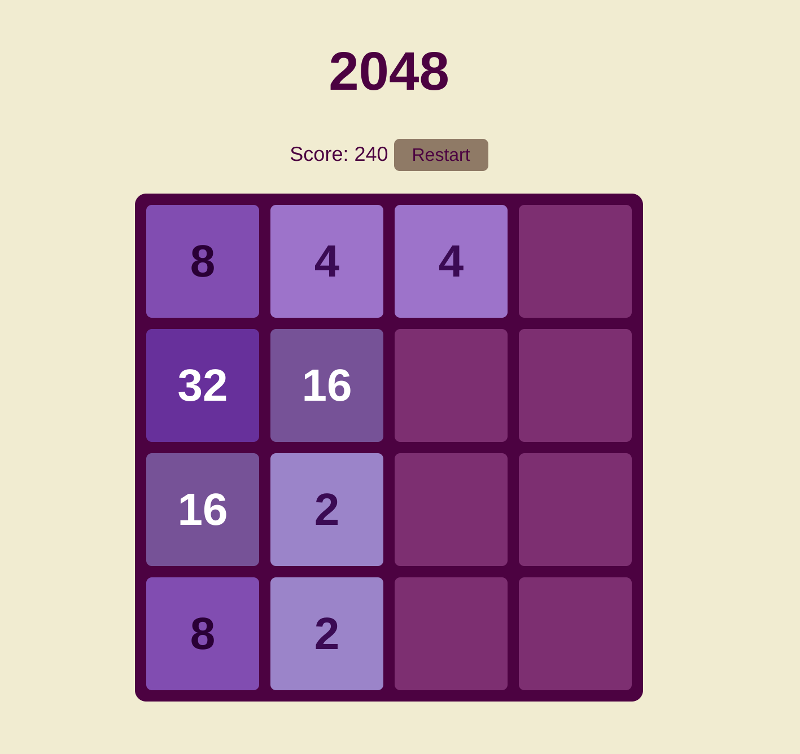
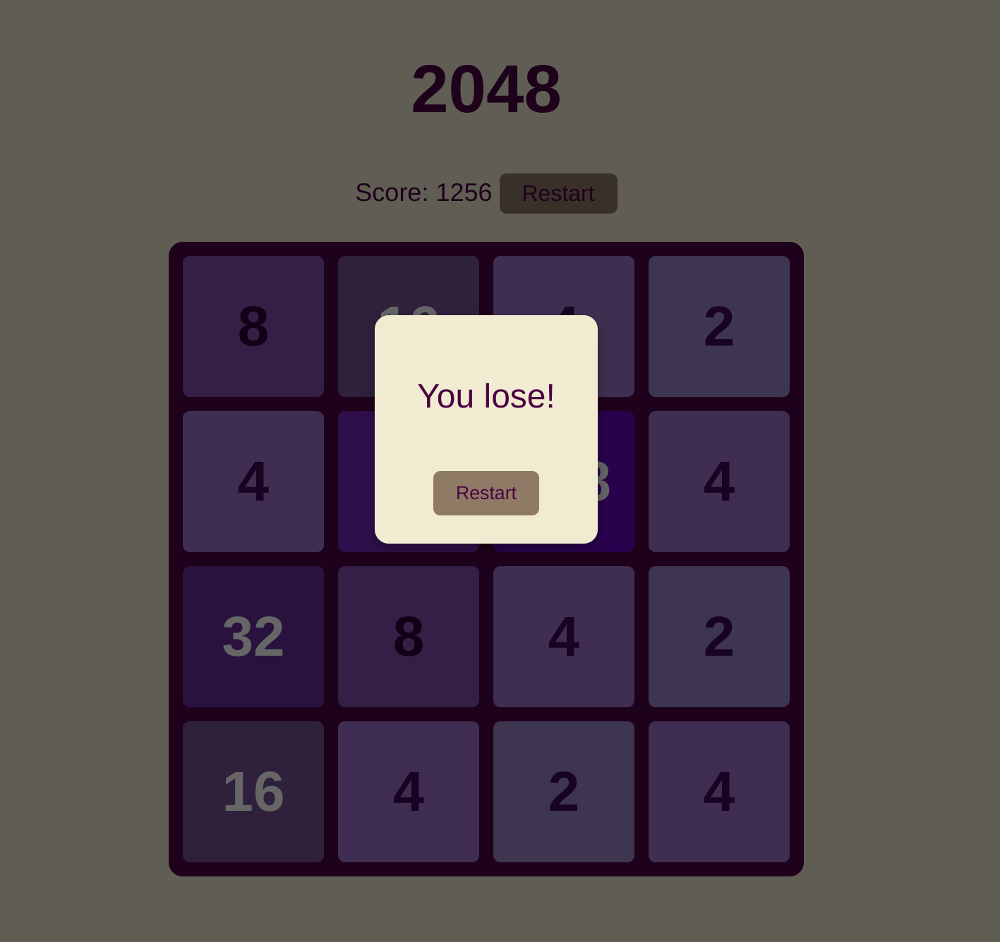

# 2048

Simple 2048 clone used for the Piscine Globant exercise.

  

## Description
A minimal implementation of the 2048 game using plain JavaScript, HTML and CSS. 

## How to run
1. Open `index.html` in your browser, or
2. From the project folder run a simple server and open the page:
   - python: `python3 -m http.server 8000`
   - then open `http://localhost:8000/`

Controls: arrow keys to move. 

Use the restart button to reset the game.

  

## Project structure
- index.html
- css/style.css
- js/game.js
- js/input.js
- README.md
